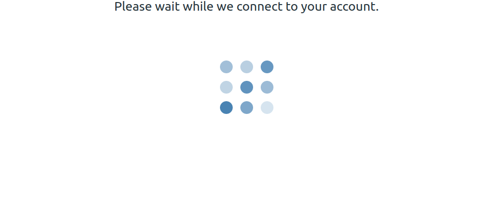
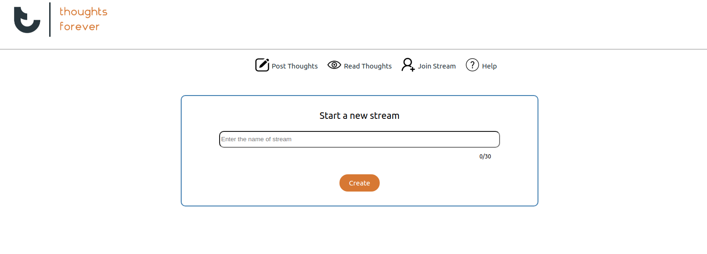
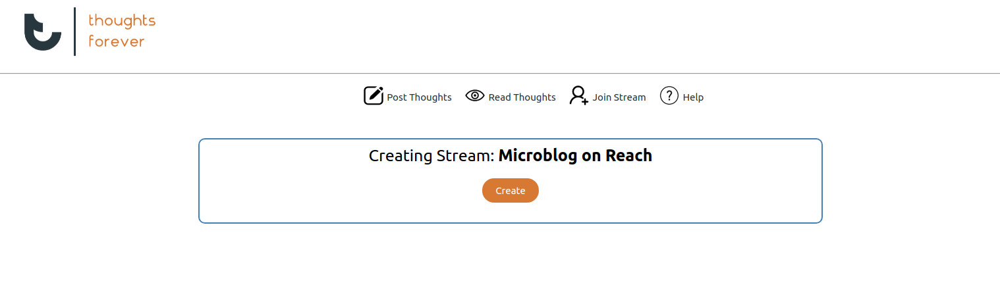
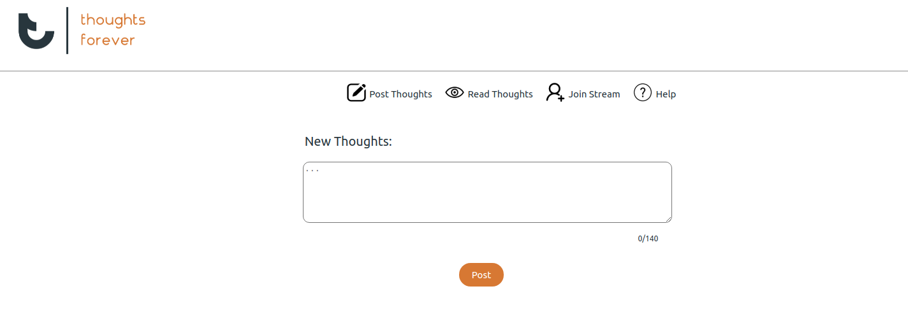
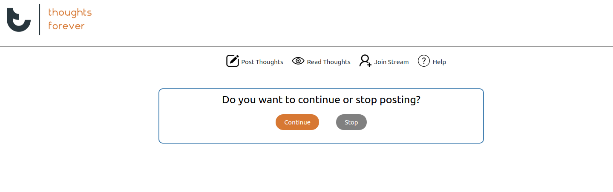
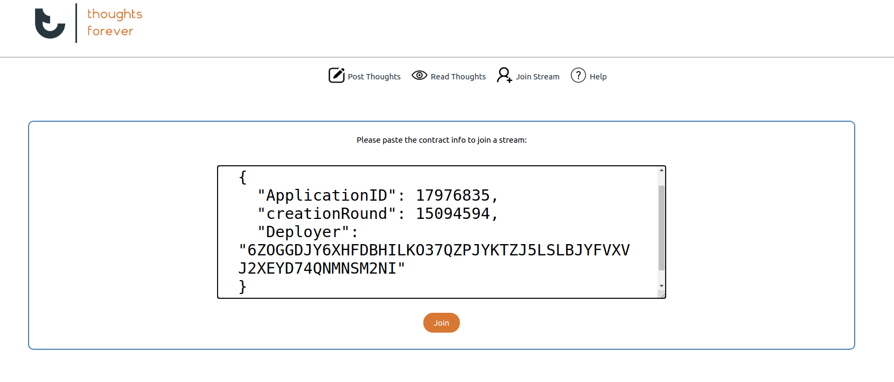
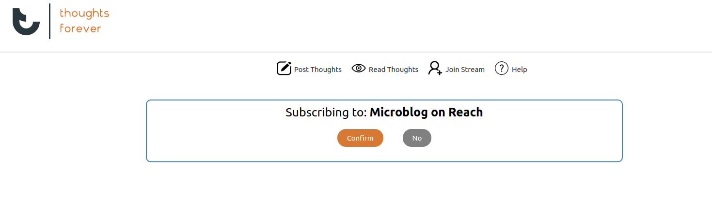
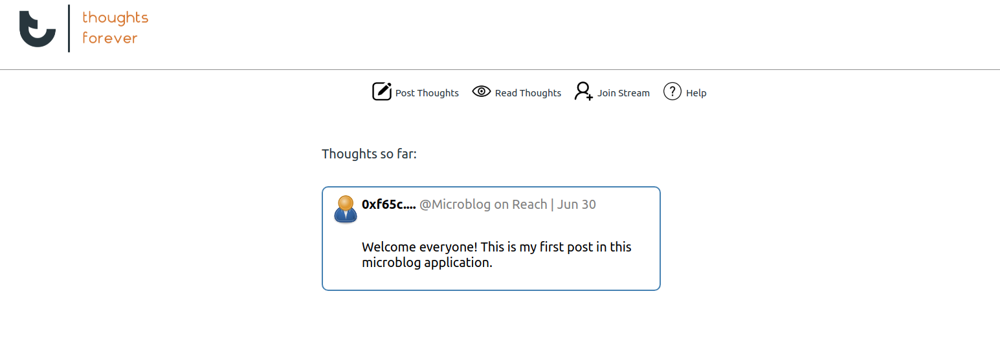
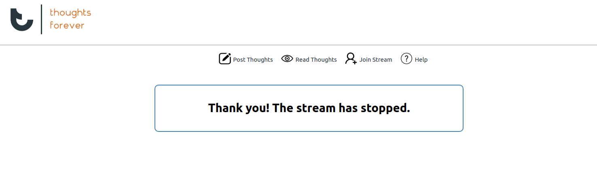

In the last section, we made Microblog run as a command-line application, without any changes to the Reach program. In this section, we won’t be making any changes to the Reach program. Instead, we’ll build a Web interface for our microblogging application.

We will use React.js for this tutorial, but the same principles apply to any Web framework.

Similarly, in this tutorial, we assume that we will be deploying (and testing) with Algorand. Reach Web applications rely on the Web browser to provide access to a consensus network account and its associated wallet. We will be using Algosigner wallet to sign our transactions. If you want to test this code, you’ll need to install it and set it up. Furthermore, Algosigner does not support multiple active accounts, so if you want to test Microblog locally, you’ll need to have two separate Chrome browser instances: one to act as Alice and another to act as Bob.

This code is supplemented with index.css and some views. These details are not specific to Reach, and are fairly trivial, so we will not explain the specifics of those files. If you run this locally, you’ll want to download those files. Your directory should look like:

—

This code is supplemented with index.css and some views. If you run this locally, you’ll want to download those files. Your directory should look like:

```
index.css
index.js
index.rsh
views
    -AppViews.js
    -AttacherViews.js
    -DeployerViews.js
    -render.js
```

We will focus on index.js file as index.rsh file is the same as previous section.

```
1    import React from 'react';
2    import AppViews from './views/AppViews';
3    import DeployerViews from './views/DeployerViews';
4    import AttacherViews from './views/AttacherViews';
5    import {renderDOM, renderView} from './views/render';
6    import './index.css';
7    import * as backend from './build/index.main.mjs';
8    import * as reach from '@reach-sh/stdlib/ALGO';
```
On lines 1 thru 6, we import our view code and CSS. On line 7, we import the compiled backend. On line 8, we import the stdlib as reach.

To run on Ethereum, change the import on line 8.

```
import * as reach from '@reach-sh/stdlib/ETH'
```

```
10 const defaults = {defaultStream: 'Microblog Project'};
```

Line 10 defines a default name for a stream. 

We start defining App as a React component, and tell it what to do once it mounts, which is the React term for starting.

 <center> *Figure 1: Connecting to an account* </center>

```
12    class App extends React.Component {
13    constructor(props) {
14        super(props);
15        
16        this.state = {view: 'ConnectAccount', ...defaults, home: true};
17    }
18    async componentDidMount() {
19        this.setState({view:'DeployerOrAttacher'});
20        
21    }
22
23    async connectToAccount () {
24        let isConnected = false;
25        try{
26
27              await reach.setProviderByName('TestNet');
28              await reach.setSignStrategy('AlgoSigner');
29              const acc = await reach.getDefaultAccount();
30              const balAtomic = await reach.balanceOf(acc);
31              const bal = reach.formatCurrency(balAtomic, 4);
32              this.setState({acc, bal});
33              isConnected = true;
34        
35        }catch(error){
36              isConnected = false;
37        
38        }
39        return isConnected;
40
41    }
```

On line 15, we initialize the component state to display the ConnectAccount view (figure 1).

On lines 18 through 20, we hook into React’s componentDidMount lifecycle event, which is called when the component starts. Here, we render the `DeployerOrAttacher` view from /views/AppViews.js

 <center> *Figure 2: Get Started View* </center>

Line 23 defines the `connectToAccount` method which is invoked when the user tries to deploy or connect to a smart-contract. 

Line 27 sets the default network to Algorand Testnet 
Line 28 indicates that we use Algosigner to sign our transactions. 
Note: Algosigner is currently only supported on Chrome, so if you wish to try this out on other browser, comment this line.

On line 29, we use getDefaultAccount, which accesses the default browser account. 

```
42    
43    async fundAccount(fundAmount) {
44        await reach.transfer(this.state.faucet, this.state.acc, reach.parseCurrency(fundAmount));
45        this.setState({view: 'DeployerOrAttacher'});
46    }
47    async skipFundAccount() { this.setState({view: 'DeployerOrAttacher', home: true}); }
48    
49    selectJoin() { this.setState({home:false, poster: false, subscriber: true, view: 'Wrapper', ContentView: Subscriber});}
50    async selectCreate() {
51        let isConnected = await this.connectToAccount(); 
52        
53        if(isConnected) this.setState({home:false, subscriber: false, poster:true, view: 'Wrapper', ContentView: Poster}); 
54        else {
55              this.setState({home:false, view: 'NoAlgosigner'});
56        }
57    }
58    aboutUs() {this.setState({home:false, view:'AboutUs'})}
59    
60    render() { return renderView(this, AppViews); }
61    }
```

Line 43 defines the `fundAccount` method for receiving some test network funds to your account. Note: This is only enabled in certain devnets. 

Line 47 defines the `skipFundAccount` method which is invoked if your account has enough funds to interact with the smart contract.

Line 49 defines the `selectJoin` method for joining a stream

 <center> *Figure 3: Creating a new stream* </center>

Line 50 defines the `selectCreate` method to deploy a stream after connecting to an account selected by the user.

Next, we will define User as a react component which will be extended by both Creator and Subscriber.

```
63    class User extends React.Component {
64        async endStream(){
65            this.setState({createdFirstPost: false, sawFirstPost:false, view: 'EndStream'});
66        }
67        
68    }
```

This component is only responsible of rendering `EndStream` view when Creator ends the stream.

Next, we will define Poster as a React component for Alice, which extends User.

```
71    class Poster extends User {
72    constructor(props) {
73        super(props);
74        const address = props.acc.getAddress();
75        this.state = {view: 'CreateStream',posts: [], seePost:false, subscriberPosts: [], sawFirstPost: false, address:address, createdFirstPost: false}; 
76    }
77
78    async deploy() {
79        const ctc = this.props.acc.deploy(backend);
80        this.setState({view: 'Deploying', ctc});
81        backend.Alice(ctc, this);
82        const ctcInfoStr = JSON.stringify(await ctc.getInfo(), null, 2);
83        this.setState({view: 'WaitingForAttacher', ctcInfoStr});
84    }
85
86    async setStreamName(streamName){
87        this.setState({view: 'Deploy', streamName});
88    }
89    async createStream() { 
90        return this.state.streamName; 
91    }
92
93    selectJoin() { 
94        this.setState({home:false, poster: false, joinStream: true, subscriber: true, view: 'Wrapper', ContentView: Subscriber});
95    }
96    
97    selectView() {
98        
99              if(!this.state.sawFirstPost) this.setState({home:false, poster: false, subscriber: true, view: 'Wrapper', ContentView: Subscriber});
100             else {this.setState({home:false, poster: false, joinStream:false, subscriber: true, seePost:false, view: 'Wrapper', ContentView: Subscriber})}
101    }
102    selectCreate() { 
103             if(this.state.createdFirstPost) this.setState({view: 'PostThought'}); 
104             else this.setState({view: 'CreateStream'});
105    }
106    async post(){
107        const thought = await new Promise(resolvePostedP => {
108             this.setState({view: 'PostThought', posts: this.state.posts, resolvePostedP});
109        });
110        this.setState({view: 'SeePost', createdFirstPost:true, posts: [...this.state.posts, thought], thought});
111        return thought;
112    }
113
114    async continueStream(){
115        const decision = await new Promise(resolveContinueP => {
116             this.setState({view: 'ContinueOrStop',  resolveContinueP});
117        });
118        return decision;
119    }
120
121    async postThought(thought) { this.state.resolvePostedP(thought); }
122
123    async continue(decision) { 
124        if(decision === 'Continue') decision = 0;
125        else if(decision === 'Stop') decision = 1;
126        this.state.resolveContinueP(decision);
127    }
128
129    async help() {
130        this.setState({view:'Help'})
131    }
132    
133    render() { return renderView(this, DeployerViews); }
134    }
```
Line 75 sets the view to `CreateStream`

Line 78 defines the method to deploy the contract and switches the view to `WaitingForAttacher` while atleast one subscriber joins the stream.


 <center> *Figure 4: Deploying the smart contract* </center>

Line 86 defines the `setStreamName` method to ask the creator set a name to the stream they wish to deploy.

Line 89 returns the name of the stream chosen by the user to the reach program (backend)

Line 93 switches the view to `Subscriber` if the user wishes to post to a stream and join different streams at the same time.

Line 97 defines a similar `selectCreate` method as defined earlier, except this method can also allow users to post if they've already created a stream.


 <center> *Figure 5: Posting thoughts to a stream* </center>

On lines 106 through 111, we set the component state to display the `PostThought` view, and wait for a Promise which can be resolved via user interaction.


.png) <center> *Figure 6: Your posts* </center>

Line 121 resolves this promise.

 <center> *Figure 5: Posting thoughts to a stream* </center>

Similarly, lines 114 through 118 sets the component state to display `ContinueOrStop` view, and wait for a Promise which can be resolved via user interaction.

Lines 123 through 126 resolve this promise.

Line 129 defines the `help` method to display the terminology and process of utilizing this application

Finally, lines 133 renders appropriate views from `DeployerViews`.

Similarly, we also define Subscriber as a React component for Bob, also extending User.

```
136    class Subscriber extends User {
137    constructor(props) {
138        super(props);
139        
140        if(props.sawFirstPost && !props.joinStream) {this.state = {view: 'ViewPost', alreadyViewed: true, posts: props.subscriberPosts}}
141        else {this.state = {view: 'Attach', posts: []}};
142    }
143    joinNewStream() {
144        this.props.parent.setState({joinStream:false});
145        this.setState({view:'Attach'})
146    }
147    
148    viewPosts() {
149        this.props.parent.setState({seePost:true});
150        this.setState({view:'ViewPost'})
151    }
152    
153    attach(ctcInfoStr) {
154        const ctc = this.props.acc.attach(backend, JSON.parse(ctcInfoStr));
155        this.setState({view: 'Attaching'});
156        backend.Bob(ctc, this);
157    }
158
159     subscribe(yesOrNo) {
160            
161         if(yesOrNo === 'Yes'){
162             this.state.resolveAcceptedP();
163             this.setState({view: 'WaitingForTurn', joining:true});
164         }
165         else{
166             this.setState({view: 'Attach'});
167         }
168     }
169
170    
171    async seeStream(streamName){
172        await new Promise(resolveAcceptedP => {
173             this.setState({view: 'ViewStreamName', streamName, resolveAcceptedP});
174        });
175        return true;
176    }
177    
178    async seeMessage(post, streamName, address){
179        let newPost = {
180             thought: post,
181             stream: streamName,
182             address: address
182        }
183        this.props.parent.setState({subscriberPosts: [...this.props.parent.state.subscriberPosts, newPost],seePost:true, sawFirstPost: true});
184        
185        await this.setState({view: 'ViewPost', alreadyViewed:false, posts: [...this.state.posts, newPost]});
186    }
187    
188    render() { return renderView(this, AttacherViews); }
189    }
```

 <center> *Figure 7: Subscribing to a stream* </center>

The contructor method checks if the user is already subscribed to a stream, and if they are, the componenet state will be set to `ViewPost` and if they aren't subscribed to any stream yet, the component state will be set to `Attach`.


 <center> *Figure 8: Subscribing to the stream* </center>

Line 143 defines the method `joinNewStream` to join a different stream than what they've previously joined.

 <center> *Figure 9: Viewing Posts </center>

Line 148 defines the method `viewPosts` allowing subscribers to view all the posts posted to the streams they've subscribed to.

Line 153 defines the `attach` method which is invoked when the user clicks `Join` button.

Line 159 defines the `subcribe` method which accepts the decision of whether or not the subcriber wishes to join the stream. 

Line 159 through 164 defines the `seeStream` method for displaying the name of the stream before joining. This method also waits for a Promise which can be resolved via user interaction.

On lines 166 through 174, we define the `seeMessage` method to store newly created posts by the author and set the component state to `ViewPost` to display the posts to the subscribers.

 <center> *Figure 10: Stopping the stream* </center>

```
191 renderDOM(<App />);
```

Finally, we call a small helper function from tut-9/views/render.js to render our App component.

The default network on Reach is Ethereum. To deploy the application on Algorand:

```
export REACH_CONNECTOR_MODE=ALGO
```

As a convenience for running the React development server, you can call:

```
$ ./reach react
```

